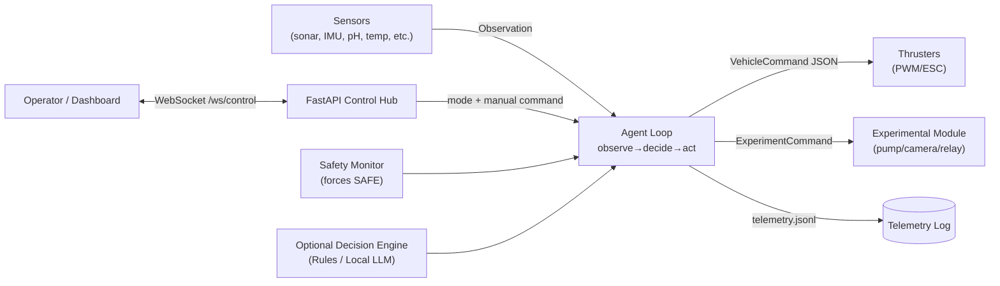
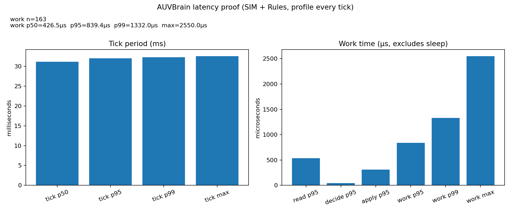

# AUVBrain

AUVBrain is an **offline-capable autonomy stack** for an experimental AUV (Raspberry Pi friendly).
It provides the complete wiring from sensors → decisions → actuators, with safety overrides,
telemetry logging, and an operator control hub (FastAPI + WebSocket).

The “brain” is not the base model weights. The defensible engineering is:
- A deterministic **observe → decide → act** agent loop
- A safety layer that can **force SAFE** regardless of the decision engine
- Hardware adapters that let the same code run in simulation or on the vehicle
- An API/control hub for monitoring and manual override

## What this repo includes

- **Agent loop** that produces VehicleCommand outputs at a fixed cadence
- **Safety monitor** (depth/battery/temp/ingress/obstacle limits) that overrides unsafe actions
- **Telemetry** (append-only JSONL) for replay/debugging and mission evidence
- **Hardware bridge** for thrusters + sensors + experiment module (SIM + Raspberry Pi adapters)
- **LLM providers** (optional):
	- Rules engine (always offline)
	- OpenAI-compatible local server (vLLM/TGI/llama.cpp server/etc.)
	- In-process GGUF via llama.cpp (fully offline; no server)
- **Latency benchmark + PNG proof** you can regenerate offline

## Architecture (one picture)



## Modes

- **AUTONOMOUS**: agent loop drives the vehicle
- **MANUAL**: vehicle applies operator commands (REST/WS)
- **SAFE**: neutral thrusters + experiments disabled

## Quick start (Windows dev / SIM)

```powershell
cd C:\Users\bc833\llm
py -m venv .venv
\.\.venv\Scripts\Activate.ps1
pip install -e .[dev]

# Terminal 1: API (docs + manual override)
auv-api

# Terminal 2: agent loop (simulation adapters)
auv-agent
```

Open API docs: http://127.0.0.1:8000/docs

## Fully offline autonomy (no internet)

You can run **fully offline** in two layers:

1) Always-on deterministic autonomy (Rules)
- Set `AUV_USE_LLM=false` to run purely offline with Rules.

2) Offline local model (optional)
- Keep safety + Rules fallback enabled so the vehicle stays autonomous even if the model stalls.

### Option A: In-process GGUF via llama.cpp (no server)

```powershell
pip install -e .[local-llm]

# .env
AUV_USE_LLM=true
AUV_LLM_PROVIDER=LLAMA_CPP
AUV_LLAMA_CPP_MODEL_PATH=C:\path\to\model.gguf

# Bound worst-case decision latency; on timeout it falls back to Rules
AUV_DECISION_TIMEOUT_S=0.4
AUV_LLM_FALLBACK_ENABLED=true
```

### Option B: Your own local model server (OpenAI-compatible)

Works with many offline servers that expose `POST /v1/chat/completions`.

```powershell
# .env
AUV_USE_LLM=true
AUV_LLM_PROVIDER=OPENAI_COMPAT
AUV_OPENAI_COMPAT_URL=http://127.0.0.1:8001
AUV_OPENAI_COMPAT_MODEL=local-model

AUV_DECISION_TIMEOUT_S=0.4
AUV_LLM_FALLBACK_ENABLED=true
```

## Hardware + experiments

### Thrusters (4 motors)

The control contract is 4-DOF thrusters:
- surge (forward/back)
- sway (left/right)
- heave (up/down)
- yaw (turn)

Adapters mix those into 4 motor outputs (m0..m3) using one of these layouts:
- `AUV_THRUSTER_LAYOUT=VECTORED_4_HORIZONTAL` → surge+sway+yaw
- `AUV_THRUSTER_LAYOUT=H2_V2` → surge+heave+yaw

### Sensors (typical 4-sensor set)

Recommended core signals:
- Depth/pressure → depth_m (and optionally pressure_bar)
- Battery voltage → battery_v
- Obstacle distance → obstacle_front_m
- Leak or internal temperature → water_ingress / internal_temp_c

### Experiments (adaptable)

Experiments are intentionally open-ended:
- enabled / action
- params (free-form JSON)

That allows pumps/cameras/relays/samplers without changing the command schema each time.

## Control hub API

- GET /health
- GET /state
- POST /mode
- POST /command
- WS /ws/control

Run: `auv-api` then open http://127.0.0.1:8000/docs

## Telemetry

Telemetry is append-only JSONL written off the event loop for low latency.
The benchmark writes under docs/ and is safe to regenerate.

## Latency proof (PNG)

This repo includes a fully offline benchmark that runs the agent in **SIM + Rules** mode and
renders a PNG chart with tick jitter + work-time percentiles.



Current benchmark snapshot (Windows SIM, Rules, profile every tick):
- Work time p95 ≈ 0.839 ms, p99 ≈ 1.332 ms, max ≈ 2.55 ms
- Tick period p95 ≈ 32.01 ms (Windows timer resolution dominates cadence)

Regenerate (fully offline):

```powershell
pip install -e .[dev]
python scripts/latency_benchmark.py
python scripts/plot_latency.py
```

## GitHub Pages (public flow + outputs)

This repo ships a tiny static site in `docs/` that shows the system flow diagrams and the benchmark outputs.

- https://chandu1234678.github.io/AUVBrain/

## Configuration

See the complete list of environment variables in .env.example.

## Raspberry Pi notes

- Run headless to save RAM.
- Install Pi adapters: `pip install -e .[raspi]`
- For real thrusters/experiments, wire GPIO logic in src/auvbrain/hardware/raspi_gpio.py
